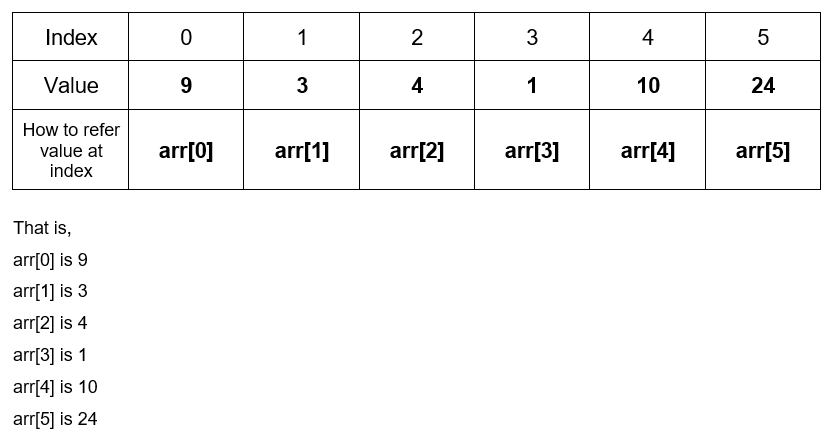

# For Loop Example 2 Array Elements Visualized

**The elements of an array named "arr" can be shown as follows:**

These elements are accessed one by one, by having the variable i as the index when accessing the elements of the array, as arr[i]